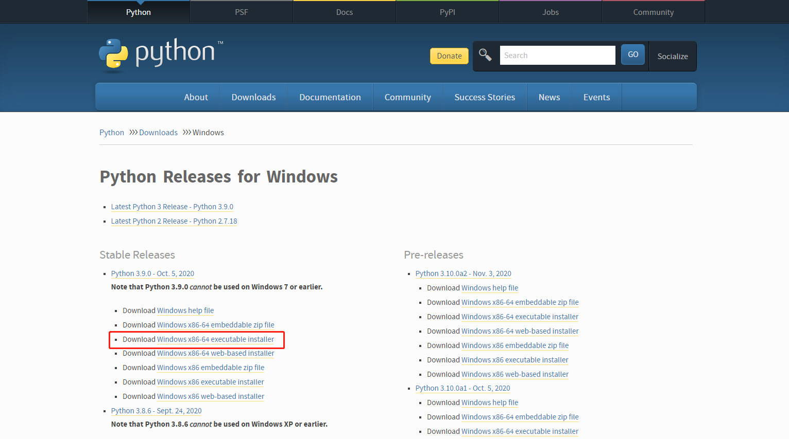
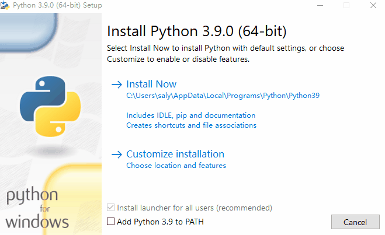
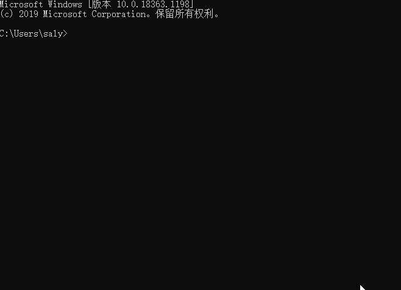
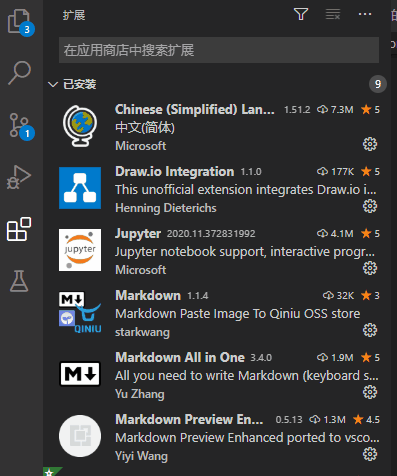
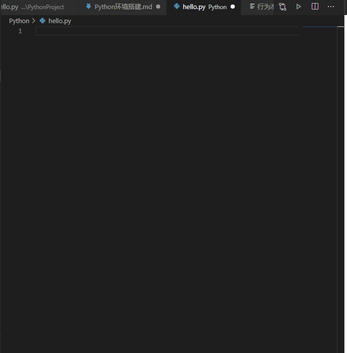

# Python环境搭建

## Python安装

Python官网：<https://www.python.org/>

官网有Python2.x和Python3.x两种版本，Python2默认编码格式是ASSCII,会有中文编码问题，需要在文件头部写# coding=utf-8;Python3.x默认编码格式为UTF-8。

Python 3.9.0要求Windows7以上版本，根据自己电脑安装即可。

安装过程很简单，一直点击下一步即可，最后一步勾选Add Python to Path，可以直接帮你把Python环境变量配好，不然还要自己配置环境变量。

到这里Python已经安装完成。

## 检查Python是否安装成功

方法：
1.Windows+R 打开cmd,输入Python,点击回车。
2.输入import this,欣赏Python之禅。
3.退出。

## 安装Python集成开发环境

下面两个都是Python的集成开发环境，任选其一。
1.PythonCharm
2.VScode

### VScode安装

下载地址：<https://code.visualstudio.com/>

安装VScode非常简单，一路NEXT就可以。

### VScode配置

#### 安装Python插件

1.打开VScode，进入插件管理页面。
2.在搜索栏输入python。
3.选择插件，点击安装。

#### 创建本地文件夹以及python文件

#### 编写python文件

